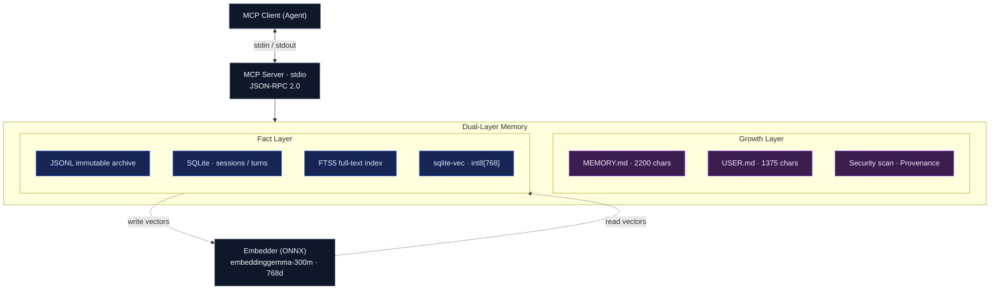

# Asuna Memory System

> Long-term memory system for AI Agents — MCP Server

[中文](README.md) | [AI Agent Install Guide](for_ai.md)

---

## Installation

### Option 1: Download from GitHub Release (Recommended)

Go to [Releases](https://github.com/Michaol/asuna-memory-system/releases) and download the pre-built package for your platform (includes ONNX Runtime dynamic library):

| Platform            | File                                      |
| ------------------- | ----------------------------------------- |
| Windows x86_64      | `asuna-memory-windows-x64.exe.zip`        |
| Linux x86_64        | `asuna-memory-linux-x64.tar.gz`           |
| Linux ARM64         | `asuna-memory-linux-arm64.tar.gz`         |
| macOS Apple Silicon | `asuna-memory-macos-apple-silicon.tar.gz` |

Extract and add to PATH:

```bash
# Linux x64
tar xzf asuna-memory-linux-x64.tar.gz
sudo mv asuna-memory /usr/local/bin/

# macOS
tar xzf asuna-memory-macos-apple-silicon.tar.gz
sudo mv asuna-memory /usr/local/bin/

# Windows: extract zip, place asuna-memory.exe in PATH
```

### Option 2: Build from Source

Requires **Rust 1.75+** (install via `rustup`). No external database needed — SQLite is bundled.

```bash
git clone https://github.com/Michaol/asuna-memory-system.git
cd asuna-memory-system
cargo build --release
```

Binary at `target/release/asuna-memory` (`.exe` on Windows).

### Quick Verification

```bash
# Check environment
asuna-memory doctor

# Start MCP server
asuna-memory serve
```

### MCP Client Configuration

Add to your MCP client config:

```json
{
  "mcpServers": {
    "asuna-memory": {
      "command": "asuna-memory",
      "args": ["serve"]
    }
  }
}
```

> **For AI Agents**: If you are an AI Agent that needs to auto-install this system, read [for_ai.md](for_ai.md) for complete installation, invocation, and tool parameter documentation.

### Important Notes

1. **ONNX Runtime (optional)**: Semantic search requires the ONNX Runtime dynamic library. Without it, the system gracefully falls back to keyword-only search.
2. **Model files (optional)**: Semantic search requires the `embeddinggemma-300m-q8` model. The system searches these paths in order:

   - `~/.asuna/models/embeddinggemma-300m-q8`
   - On Windows, supports `ASUNA_DEV_ROOT` env var for dev paths
   - Compatible with EmbeddingGemma tokenizer format (no `token_type_ids` required)
   - Falls back to keyword search if not found

3. **Data directory**: Defaults to `~/.asuna/`. Created automatically on first run.
4. **Profile isolation**: Each profile's data is stored under `~/.asuna/profiles/{profile_id}/`.

---

## Architecture

Asuna Memory System uses a **dual-layer memory architecture**:



### Fact Layer

- **Conversation storage**: Each conversation archived as JSONL in `conversations/YYYY/MM/DD/`
- **Index**: SQLite stores session metadata and turn summaries
- **Full-text search**: FTS5 contentless virtual table with Chinese unigram tokenization (v1.1.3+ automatic schema migration)
- **Vector search**: sqlite-vec extension, 768-dim INT8 quantized vectors, automatically written on save/import/rebuild
- **Hybrid search**: Reciprocal Rank Fusion (RRF) combining semantic + keyword results

### Growth Layer

- **Bounded memory**: `MEMORY.md` (AI knowledge, 2200 char limit) and `USER.md` (user profile, 1375 char limit)
- **Entry separator**: Uses `§` between entries
- **Security scan**: Automatic detection of prompt injection, credential leakage, and invisible Unicode on every write/update
- **Provenance tracking**: Each memory entry traces back to its source conversation session

---

## MCP Tools

| Tool                | Description                                           |
| ------------------- | ----------------------------------------------------- |
| `save_session`      | Save a complete conversation (auto-generates vectors) |
| `search_sessions`   | Multi-dimensional historical conversation search      |
| `memory_write`      | Write a new entry to growth memory                    |
| `memory_update`     | Update an existing memory entry via substring match   |
| `memory_remove`     | Remove a memory entry                                 |
| `memory_read`       | Read the full growth memory content                   |
| `user_profile`      | Read/write user profile                               |
| `rebuild_index`     | Rebuild index from JSONL files (FTS + vectors)        |
| `memory_provenance` | Verify provenance of growth memory entries            |

Detailed parameter documentation in [for_ai.md](for_ai.md).

---

## JSONL File Format

The `import` and `rebuild` commands read JSONL files: **1 Header line + N Turn lines**, one JSON object per line.

### Header (line 1)

| Field         | Type     | Required | Description                                            |
| ------------- | -------- | -------- | ------------------------------------------------------ |
| `v`           | integer  | yes      | Format version, currently `1`                          |
| `type`        | string   | yes      | Always `"session_header"`                              |
| `session_id`  | string   | yes      | Unique session ID (UUID or custom string)              |
| `start_time`  | string   | yes      | ISO 8601 timestamp (e.g., `2026-04-10T10:02:00+08:00`) |
| `profile_id`  | string   | yes      | Profile ID (usually `"default"`)                       |
| `source`      | string   | no       | Source identifier (e.g., `"openclaw"`, `"chatgpt"`)    |
| `agent_model` | string   | no       | Agent model name                                       |
| `title`       | string   | no       | Session title                                          |
| `tags`        | string[] | no       | Tag list                                               |

### Turn (lines 2+, one per conversation turn)

| Field          | Type    | Required | Description                                                             |
| -------------- | ------- | -------- | ----------------------------------------------------------------------- |
| `ts`           | string  | yes      | ISO 8601 timestamp                                                      |
| `seq`          | integer | yes      | Turn sequence number, starts at `1`                                     |
| `role`         | string  | yes      | `"user"` / `"assistant"` / `"tool_call"` / `"system"`                   |
| `content`      | string  | yes      | Turn content                                                            |
| _extra fields_ | any     | no       | Flattened via `#[serde(flatten)]` (e.g., `model`, `usage`, `tool_name`) |

### Example

````jsonl
{"v":1,"type":"session_header","session_id":"a1b2c3d4-e5f6-7890-abcd-ef1234567890","start_time":"2026-04-10T10:02:00+08:00","profile_id":"default","source":"manual","title":"Example session","tags":["demo"]}
{"ts":"2026-04-10T10:02:00+08:00","seq":1,"role":"user","content":"Hello, help me write a Rust Hello World"}
{"ts":"2026-04-10T10:02:05+08:00","seq":2,"role":"assistant","content":"Sure! Here is a minimal Rust Hello World:\n\n```rust\nfn main() {\n    println!(\"Hello, World!\");\n}\n```","model":"gpt-4","usage":{"input_tokens":15,"output_tokens":42}}
````

> **Note**: `import` uses JSONL format (`ts` / `seq` fields). `save_session` MCP tool uses `timestamp` field and auto-assigns `seq`. Both produce the same stored format.

### Importing

```bash
# Single file
asuna-memory import my_session.jsonl

# Batch import
for f in sessions/*.jsonl; do
  asuna-memory import "$f"
done
```

## When to Save

| Scenario           | When             | Notes                                                      |
| ------------------ | ---------------- | ---------------------------------------------------------- |
| Agent conversation | End of each turn | Ensures conversation is archived for later search          |
| Batch migration    | One-time import  | Use `import` command to bulk-import JSONL files            |
| Periodic archive   | On a schedule    | Good for high-frequency chat (e.g., customer support bots) |
| User-triggered     | On user request  | Important conversations saved on demand                    |

Recommended: save after each conversation turn. Same `session_id` = overwrite (INSERT OR REPLACE).

## CLI Commands

```bash
# Start MCP server (default command)
asuna-memory serve

# Environment check
asuna-memory doctor

# List all profiles
asuna-memory list-profiles

# List recent sessions
asuna-memory list-sessions --last-days 7 --limit 20

# Search conversations
asuna-memory search "Rust async" --mode keyword --top-k 5

# Rebuild index from JSONL (FTS + vectors)
asuna-memory rebuild

# Import a JSONL file
asuna-memory import session.jsonl

# Export session summary
asuna-memory export <session_id>
```

### Global Parameters

| Parameter   | Default                | Description      |
| ----------- | ---------------------- | ---------------- |
| `--config`  | `~/.asuna/config.json` | Config file path |
| `--profile` | `default`              | Active profile   |

---

## Upgrade Guide

### Upgrading from v1.2.0 to v1.2.1 (Strongly Recommended)

v1.2.1 is a **security and quality hardening** release that closes 1 Critical-severity **path traversal** vulnerability and several data-correctness issues. All users should upgrade as soon as possible.

```bash
# 1. Replace the binary

# 2. Rebuild index — query/document prefix split means new vectors recall noticeably better
asuna-memory rebuild

# 3. Verify (new fields surfaced)
asuna-memory doctor
# Expected:
#   版本: v1.2.1
#   外键约束: ON
```

**v1.2.1 Changelog:**

**🔴 Critical Fixes:**

- **Path Traversal**: `memory_write` / `memory_update` / `memory_remove` no longer trust the `target` argument as a path component. A strict whitelist (`memory` / `user`) is enforced, blocking `../../foo` style escapes.

**🟠 Important Fixes:**

- **EmbeddingGemma prefix separation**: Save/rebuild paths now use the `title: none | text:` (Document) prefix; search-query path uses `task: search result | query:` (Query). The two no longer share the query prefix, so vector recall quality is significantly better — **`rebuild` after upgrade is strongly recommended**.
- **JSONL/SQLite atomicity**: `save_session` is now _DB tx → commit → write JSONL_, with any tx error triggering automatic `ROLLBACK`. The old "JSONL written, DB half-written" residue state is eliminated.
- **LIKE wildcard injection**: `memory_update` / `memory_remove` SQLite `LIKE` clauses use `ESCAPE '\\'` and escape `% _ \`. Operations are also now **entry-level (§-separated)** to avoid silent edits of unrelated entries.
- **§ separator robustness**: Removing several adjacent entries no longer leaves `§§§`; removing the last entry leaves only the metadata header; removing the first no longer leaves a leading `\n§\n`.
- **Chinese long-content panic**: Audit-log content truncation switched from byte slicing to `chars().take(N)` — multi-byte characters can no longer panic.
- **Foreign keys**: `PRAGMA foreign_keys = ON` is now default to prevent dangling `session_id` in `turns`.
- **Strict save_session validation**: missing `timestamp` / `role` / `content` is rejected; `role` must be one of `user` / `assistant` / `tool_call` / `system` (no silent fallback to `user`).

**🟡 Minor Improvements:**

- **Dynamic ONNX padding**: tokenizer no longer pads to a fixed 2048; pads to the batch max instead, 5–20× faster for short previews.
- **Credential regex caching**: 5 credential regexes compiled once via `OnceCell`, no per-scan recompilation.
- **Model download integrity**: streams to `.partial` temp file, validates `Content-Length`, atomic rename — interruptions can no longer leave a half-downloaded file mistakenly treated as complete.
- **doctor enhancements**: surfaces version / foreign-keys / embedding dimensions.
- **Config wiring**: `conversation.preview_length` / `search.default_top_k` / `search.search_mode` / `memory.security_scan` now actually take effect.
- **e2e tests wired in**: 6 end-to-end tests (save-then-search, overwrite, delete residue, rebuild consistency) lifted from an orphan file into the test suite.
- **Dead column removed**: `turns.embedding BLOB` dropped from schema (vectors always live in `vec_turns` virtual table).
- **Dependency cleanup**: removed unused `indicatif`; added `once_cell` / `tempfile (dev)`.

> Note: the legacy `turns.embedding` column persists in pre-existing DBs (SQLite has no automatic column drop). It is unused and harmless.

<details>
<summary><strong>Historical changelog (click to expand)</strong></summary>

### Upgrading from v1.1.4 to v1.2.0

v1.2.0 is a **reliability and security hardening** release, fixing 2 Critical data consistency issues and 8 Important functional defects.

```bash
# 1. Replace the binary

# 2. Rebuild index to apply char_count fix (bytes → characters)
asuna-memory rebuild

# 3. Verify
asuna-memory doctor
```

**v1.2.0 Changelog:**

**🔴 Critical Fixes:**

- **Transaction Safety**: All database writes in `save_session` and `rebuild` are now wrapped in `BEGIN IMMEDIATE ... COMMIT` transactions, preventing half-written inconsistent state on process crash

**🟡 Important Fixes:**

- **Streaming Model Download**: Large model files no longer loaded entirely into memory; uses streaming `io::copy` to disk, avoiding OOM in memory-constrained environments
- **char_count Correction**: `turns.char_count` field now stores Unicode character count instead of UTF-8 byte count (Chinese content was inflated 3x)
- **unsafe FFI Documentation**: Complete SAFETY comments and ABI compatibility notes added to the sqlite-vec extension registration `transmute`
- **Growth Layer update() Fix**: Replacement now operates on body only, preventing accidental metadata header modification; auto-updates timestamp; syncs changes to SQLite `bounded_memory` table
- **Growth Layer remove() Fix**: Delete operations now sync to SQLite `bounded_memory` table; `list_entries()` and `verify_provenance()` no longer return deleted entries
- **Query Optimization**: `list_entries()` merged duplicate queries for the same session_id
- **MCP Error Handling Documentation**: tools/call `content + isError` error format documented with MCP protocol spec reference

**🟢 Minor Improvements:**

- **Empty turns validation**: `save_session` validates non-empty turns before parsing, returning a friendly error instead of timestamp parse failure
- **Timestamp safety**: `unix_ms_to_iso()` uses epoch fallback for invalid timestamps, eliminating potential panics
- **Deprecated db_path field**: `db_path` in `config.json` marked as deprecated (actual DB path determined by `profile_db_path()`), backward compatible

### Upgrading from v1.1.3 to v1.1.4

v1.1.4 fixes a regression where the vector index could drop to zero after a `rebuild` command in certain environments, and optimizes rebuild performance.

```bash
# 1. Replace the binary

# 2. Rerun rebuild to restore potentially missing vector indices
asuna-memory rebuild
```

**v1.1.4 Changelog:**

- **Vector Index Regression Fix**: Resolved a silent failure in SQLite `vec0` virtual table writes caused by read/write cursor concurrency conflicts during `rebuild`.
- **Rebuild Performance Optimization**: Consolidated the query paths for FTS and vector index rebuilding, reducing DB IO by 50% and improving speed for large datasets.
- **Improved Diagnostics**: Replaced silent error suppression with proper `warn!` logging for better observability during the index reconstruction process.

### Upgrading from v1.0.x to v1.1.0

v1.1.0 fixes the vector database not being populated. After upgrading, rebuild the index to backfill vector data:

```bash
# 1. Replace the binary

# 2. Rebuild index (rebuilds both FTS and vector index)
asuna-memory rebuild

# 3. Verify
asuna-memory doctor
# Expected output includes:
#   索引统计: 10 会话, 24 轮对话, 24 个向量
```

**v1.1.0 Changelog:**

- `rebuild` now generates int8 embeddings for all turns and writes them to the `vec_turns` table
- `save_session` / `import` automatically generate vectors when the embedding model is available
- `doctor` now shows the vector index count
- All write paths (save / import / rebuild / MCP) share a unified embedding pipeline

</details>

---

## Configuration

JSON format, default path `~/.asuna/config.json`. Uses built-in defaults if absent.

```json
{
  "data_dir": "~/.asuna",
  "profile_id": "default",
  "conversation": {
    "enabled": true,
    "auto_embed": true,
    "preview_length": 200
  },
  "memory": {
    "memory_enabled": true,
    "user_profile_enabled": true,
    "memory_char_limit": 2200,
    "user_char_limit": 1375,
    "security_scan": true
  },
  "search": {
    "default_top_k": 5,
    "search_mode": "hybrid",
    "fts_enabled": true
  },
  "embedding": {
    "model_name": "embeddinggemma-300m-q8",
    "dimensions": 768,
    "batch_size": 32
  },
  "model_path": null
}
```

---

## Data Directory Structure

```text
~/.asuna/
├── config.json
├── profiles/
│   └── default/
│       ├── memory.db                   # SQLite (includes vec_turns vector table)
│       ├── conversations/
│       │   └── 2026/
│       │       └── 04/
│       │           └── 10/
│       │               └── 20260410T100200_abc12345.jsonl
│       └── memory/
│           ├── MEMORY.md
│           └── USER.md
└── models/
    └── embeddinggemma-300m-q8/
```

---

## Security

Automatic pre-write security scanning on the growth layer:

- **Prompt injection detection**: Pattern matching in English and Chinese (e.g., "ignore previous instructions", "忽略之前的指令")
- **Credential leak detection**: OpenAI `sk-*`, GitHub `ghp_*`, AWS `AKIA*`, PEM private keys
- **Invisible Unicode detection**: Zero-width characters, BOM, etc.

Write operations are rejected with a specific reason when scanning fails.

---

## License

MIT
