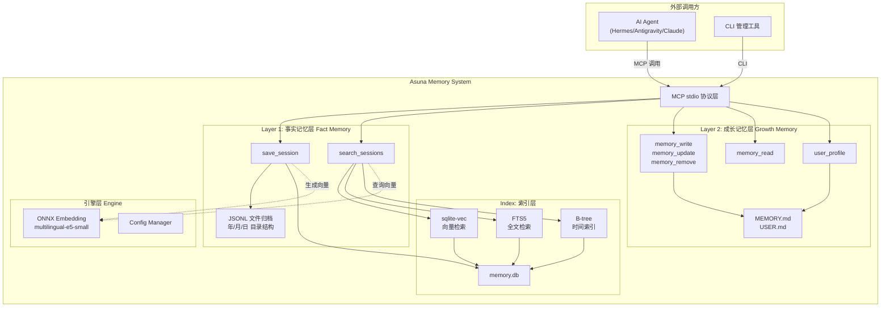

# Asuna Memory System — 完整架构设计文档

> **版本**：v0.1 Draft · **日期**：2026-04-10
> **定位**：基于 RustRAG 技术栈的全新独立 AI Agent 通用记忆系统

---

## 一、项目概述

### 1.1 项目目标

构建一个**纯本地、可审计、支持共同成长**的 AI Agent 记忆系统。系统作为 MCP (Model Context Protocol) 服务器运行，可被任何兼容 MCP 的 AI Agent（Hermes、Antigravity、Claude Desktop、Cursor 等）调用。

### 1.2 核心设计哲学

```
"底层像共同经历的原始档案、聊天记录、日记"
"上层像随着相处慢慢形成的理解、默契、偏好判断"
```

| 原则             | 解释                                       |
| ---------------- | ------------------------------------------ |
| **原文保真**     | 原始对话逐字保存，不擅自总结替代           |
| **不自作聪明**   | 事实层永远忠实于原始记录                   |
| **成长可撤销**   | 所有推断、归纳、偏好建模都是可回退的解释层 |
| **本地可控**     | 全部数据存储在用户本地文件系统             |
| **可审计可追溯** | 每条记忆有时间戳、来源、修改历史           |

### 1.3 与 RustRAG 的关系

本项目是基于 RustRAG 技术栈的**独立新项目**，不是 RustRAG 的扩展模块。

| 维度     | RustRAG                          | Asuna Memory System                                |
| -------- | -------------------------------- | -------------------------------------------------- |
| 问题域   | 代码库/文档 RAG 检索             | AI Agent 长期记忆                                  |
| 核心功能 | 语义检索、AST 解析、代码关系图谱 | 对话存档、有界记忆、用户建模                       |
| 复用关系 | 技术底座来源                     | 复用 SQLite+sqlite-vec / ONNX embedding / MCP 框架 |

**不复用的组件**：Tree-sitter AST 解析、代码关系图谱、多语言词典、Markdown frontmatter。

### 1.4 技术选型

#### 开发语言：Rust

| 候选     | 内存占用          | 启动速度 | 生态兼容                                | 结论        |
| -------- | ----------------- | -------- | --------------------------------------- | ----------- |
| **Rust** | ~5-15MB（无 GC）  | 毫秒级   | RustRAG 全链路已验证（SQLite/ONNX/MCP） | ✅ **选定** |
| Go       | ~30MB+（GC 波动） | 毫秒级   | SQLite/ONNX 生态弱于 Rust               | ❌          |
| Python   | ~100MB+（运行时） | 秒级     | 依赖重，不适合常驻后台                  | ❌          |

选择 Rust 的核心理由：

1. 记忆系统作为 **常驻后台进程**，内存占用和稳定性是关键
2. 与 RustRAG 同语言，**可直接复用核心模块**（embedding、SQLite、MCP 框架）
3. 编译为单一原生二进制，**零运行时依赖**，部署极简
4. 用户（米糕）主力语言为 Rust，后续维护成本低

#### 通信协议：MCP stdio（主通道）+ CLI（辅助通道）

```
AI Agent ──── MCP stdio ─────→  asuna-memory (常驻进程, ONNX 模型热驻)
                                      ↕ 共享 SQLite (WAL 并发读写)
人工管理 ──── CLI 子命令 ────→  asuna-memory list/search/import/export
```

**MCP stdio 作为主通道**的理由：

- 所有主流 Agent 框架（Hermes / Antigravity / Claude Desktop / Cursor）**只支持 MCP**
- stdio 管道通信延迟 = **微秒级**，远低于 embedding 推理（毫秒级），不是瓶颈
- Rust binary 常驻内存仅 ~10MB，ONNX 模型和 DB 连接保持 warm

**CLI 子命令作为辅助通道**：

- 管理/调试入口：`asuna list-sessions` / `asuna search` / `asuna import` / `asuna export`
- 多数 CLI 命令**不需要加载 embedding 模型**（lazy loading 即可）
- 通过 SQLite WAL 模式与 MCP 进程安全并发读写，无需额外 daemon

**排除的方案**：

- HTTP/gRPC → 比 stdio 更重（TCP 栈 + auth），Agent 框架不原生支持
- 独立 daemon → 增加进程管理复杂度，SQLite WAL 已够用
- 共享内存/FFI → 耦合度过高，不现实

#### Embedding 模型策略

**模型选定**：`intfloat/multilingual-e5-small` — `model_O4.onnx` 变体

| 项目             | 值                                                    |
| ---------------- | ----------------------------------------------------- |
| HuggingFace 页面 | https://huggingface.co/intfloat/multilingual-e5-small |
| 架构             | BERT (Multilingual-MiniLM-L12-H384), 12 层            |
| 向量维度         | 384                                                   |
| 支持语言         | 100+ (中/英/日/韩等)                                  |
| 许可证           | MIT                                                   |

**ONNX 变体选择**：

| 变体                           | 大小       | 内存        | 精度               | 选择        |
| ------------------------------ | ---------- | ----------- | ------------------ | ----------- |
| `model.onnx` (FP32)            | 470 MB     | ~500 MB     | 基准               | ❌ 无优势   |
| **`model_O4.onnx`** (O4 优化)  | **235 MB** | **~250 MB** | **与原版完全一致** | ✅ **选定** |
| `model_qint8_avx512_vnni.onnx` | 118 MB     | ~130 MB     | 微损 + 需 AVX512   | ❌ 兼容性差 |

O4 变体是 ONNX 图级别优化（算子融合、常量折叠），**不改变数值结果**，纯粹更高效的等价表示。下载直链：
https://huggingface.co/intfloat/multilingual-e5-small/resolve/main/onnx/model_O4.onnx

**向量存储量化**：模型推理输出 `Vec<f32>` 384 维 → 存入 SQLite 前由 `serialize_vector_int8()` 标量量化为 `INT8[384]`（384 字节/向量），与 RustRAG 一致。

**模型共享策略（智能发现）**：

独立项目，独立数据库，但**可复用已有的模型文件**（只读引用）：

```
启动时模型发现流程：

1. config.json 指定了 model_path？      → 直接使用（用户手动控制）
2. 检测 RustRAG 模型目录存在 model_O4.onnx？
   ~/.rustrag/models/multilingual-e5-small/   (Linux/3865 服务器)
   或 RustRAG/models/multilingual-e5-small/   (Windows 开发环境)
                                              → 复用（省 235MB 磁盘）
3. 检测自己的模型目录？
   ~/.asuna/models/multilingual-e5-small/     → 使用自己的缓存
4. 都没有？                                  → 首次下载到 ~/.asuna/models/
```

**共享安全性**：ONNX 模型文件是只读的，两个进程各自加载到独立内存空间，零运行时干扰。

**完全隔离的部分**（不与 RustRAG 共享）：

```
~/.asuna/
├── config.json              ← 独立配置
├── profiles/
│   └── asuna/
│       ├── memory.db        ← 独立 SQLite（与 rustrag.db 完全无关）
│       ├── data/            ← 独立 JSONL 对话存档
│       ├── MEMORY.md        ← 独立成长记忆
│       └── USER.md          ← 独立用户画像
└── models/                  ← 仅在没有 RustRAG 时才自动下载
```

**Lazy Loading**：embedding 模型在首次 `search_sessions` 调用时才加载，`save_session` 时按需触发。空闲时进程内存仅 ~15MB。

---

## 二、系统架构

### 2.1 三层架构总览



### 2.2 层级职责

#### Layer 1：事实记忆层 (Fact Memory Layer)

**职责**：忠实保存一切原始交互记录，作为系统的"真实地基"。

| 属性     | 说明                                                  |
| -------- | ----------------------------------------------------- |
| 存储内容 | 完整对话轮次（user / assistant / tool_call / system） |
| 存储格式 | JSONL 文件（每个会话一个文件）                        |
| 不可变性 | 写入后**只读**，不允许修改或删除原始内容              |
| 索引机制 | 写入时同步到 SQLite 索引（向量 + FTS5 + 时间）        |
| 可重建性 | SQLite 索引可随时从 JSONL 文件完全重建                |

**核心原则**：

- 不自作聪明 — 不擅自提炼替代原文
- 不允许漂移覆盖事实 — 事实就是事实
- 是整个系统的唯一真相源 (Single Source of Truth)

#### 索引层 (Index Layer)

**职责**：为事实层提供高效检索能力。本身是**可消耗、可重建**的派生数据。

| 索引类型 | 实现                   | 用途                |
| -------- | ---------------------- | ------------------- |
| 向量索引 | sqlite-vec (INT8 量化) | 语义相似度检索      |
| 全文索引 | FTS5                   | 关键词/短语精确查找 |
| 时间索引 | B-tree on INTEGER      | 时间范围查询        |

#### Layer 2：成长记忆层 (Growth Memory Layer)

**职责**：基于事实层构建的高层理解，形成共同成长的"默契"。

| 属性     | 说明                                              |
| -------- | ------------------------------------------------- |
| 存储内容 | Agent 笔记 (MEMORY.md) + 用户画像 (USER.md)       |
| 容量     | **有界**（MEMORY: ~2200 字符 / USER: ~1375 字符） |
| 可变性   | 允许 add / update / remove                        |
| 注入方式 | 每次会话开始时作为冻结快照注入 system prompt      |
| 约束     | 成长层是**可撤销的解释层**，不能覆盖事实层        |

**成长层可以做**：提炼、归纳、假设、偏好推断、关系建模
**成长层不能做**：覆盖原始事实、替代原始对话、无审计改写用户画像、把推测当确定事实

---

## 三、数据模型

### 3.1 文件系统布局

```
~/.asuna/                              # 或自定义 ASUNA_HOME
├── config.json                        # 系统配置
├── conversations/                     # 事实层：对话全量归档
│   └── 2026/
│       └── 04/
│           └── 10/
│               ├── 20260410T100200_sess_abc123.jsonl
│               └── 20260410T143000_sess_def456.jsonl
├── memory/                            # 成长层：有界记忆
│   ├── MEMORY.md                      # Agent 笔记
│   └── USER.md                        # 用户画像
├── memory.db                          # SQLite 索引数据库
├── memory.db-wal                      # WAL 日志
├── audit.log                          # 审计日志
└── models/                            # ONNX 模型缓存
    └── multilingual-e5-small/
```

### 3.2 JSONL 对话文件格式

每个会话生成一个 `.jsonl` 文件。第一行为会话头，后续为对话轮次。

**文件命名规则**：`{ISO日期时间}_{session_id}.jsonl`
**示例**：`20260410T100200_abc123.jsonl`

```jsonc
// ═══════ 第1行：会话头 (Session Header) ═══════
{
  "v": 1,                                     // 格式版本号
  "type": "session_header",
  "session_id": "abc123",                      // 会话唯一 ID (UUID 或短 hash)
  "start_time": "2026-04-10T10:02:00.000+08:00",
  "profile_id": "default",                     // 用户 profile
  "source": "antigravity",                     // 来源客户端标识
  "agent_model": "gemini-2.5-pro",             // 主要使用的模型
  "tags": []                                   // 可选标签
}

// ═══════ 第2+行：对话轮次 (Turns) ═══════
// --- 用户消息 ---
{
  "ts": "2026-04-10T10:02:05.123+08:00",       // ISO 8601 毫秒精度
  "seq": 1,                                    // 轮次序号
  "role": "user",
  "content": "帮我分析一下 RustRAG 的架构"
}

// --- Assistant 回复 ---
{
  "ts": "2026-04-10T10:02:07.456+08:00",
  "seq": 2,
  "role": "assistant",
  "content": "RustRAG 的核心架构包括以下几个模块...",
  "model": "gemini-2.5-pro",
  "usage": {
    "input_tokens": 1500,
    "output_tokens": 800
  }
}

// --- 工具调用 ---
{
  "ts": "2026-04-10T10:02:08.789+08:00",
  "seq": 3,
  "role": "tool_call",
  "tool_name": "search",
  "arguments": {"query": "RustRAG architecture"},
  "result_preview": "Found 5 relevant chunks..."  // 结果预览 (前 500 字符)
}

// --- 系统消息 ---
{
  "ts": "2026-04-10T10:02:09.000+08:00",
  "seq": 4,
  "role": "system",
  "content": "Context compressed: 15 turns → 3 turns"
}
```

### 3.3 SQLite Schema

```sql
-- ════════════════════════════════════════════════
-- 会话索引表 (sessions)
-- ════════════════════════════════════════════════
CREATE TABLE sessions (
    session_id    TEXT    PRIMARY KEY,
    start_ts      INTEGER NOT NULL,           -- 会话开始 Unix ms
    end_ts        INTEGER,                    -- 会话结束 Unix ms
    file_path     TEXT    NOT NULL,            -- 对应 JSONL 相对路径
    title         TEXT,                        -- 会话标题 (Agent 生成)
    summary       TEXT,                        -- 会话摘要 (成长层, 可更新)
    profile_id    TEXT    DEFAULT 'default',
    source        TEXT,                        -- 来源客户端
    agent_model   TEXT,                        -- 主模型
    turn_count    INTEGER DEFAULT 0,
    total_tokens  INTEGER DEFAULT 0,
    tags          TEXT,                        -- JSON array of tags
    created_at    INTEGER NOT NULL,            -- 记录创建 Unix ms
    updated_at    INTEGER NOT NULL             -- 记录更新 Unix ms
);
CREATE INDEX idx_sessions_start    ON sessions(start_ts);
CREATE INDEX idx_sessions_profile  ON sessions(profile_id, start_ts);

-- ════════════════════════════════════════════════
-- 对话轮次索引表 (turns)
-- ════════════════════════════════════════════════
CREATE TABLE turns (
    id            INTEGER PRIMARY KEY AUTOINCREMENT,
    session_id    TEXT    NOT NULL REFERENCES sessions(session_id),
    seq           INTEGER NOT NULL,            -- 轮次序号
    timestamp_ms  INTEGER NOT NULL,            -- 该轮 Unix ms
    role          TEXT    NOT NULL,            -- user/assistant/tool_call/system
    preview       TEXT,                        -- 前 200 字符预览
    char_count    INTEGER DEFAULT 0,           -- 原文字符数
    embedding     BLOB                         -- INT8 向量 (384维)
);
CREATE INDEX idx_turns_ts      ON turns(timestamp_ms);
CREATE INDEX idx_turns_session ON turns(session_id, seq);

-- ════════════════════════════════════════════════
-- FTS5 全文检索虚拟表
-- ════════════════════════════════════════════════
CREATE VIRTUAL TABLE turns_fts USING fts5(
    preview,
    content=turns,
    content_rowid=id,
    tokenize='unicode61 remove_diacritics 2'
);

-- ════════════════════════════════════════════════
-- 有界记忆索引表 (bounded_memory)
-- ════════════════════════════════════════════════
CREATE TABLE bounded_memory (
    id            INTEGER PRIMARY KEY AUTOINCREMENT,
    target        TEXT    NOT NULL,             -- 'memory' 或 'user'
    content       TEXT    NOT NULL,
    created_at    INTEGER NOT NULL,
    updated_at    INTEGER NOT NULL,
    source_session TEXT,                        -- 来源会话 (溯源)
    confidence    TEXT    DEFAULT 'medium'      -- high/medium/low
);

-- ════════════════════════════════════════════════
-- 审计日志表 (audit_log)
-- ════════════════════════════════════════════════
CREATE TABLE audit_log (
    id            INTEGER PRIMARY KEY AUTOINCREMENT,
    timestamp_ms  INTEGER NOT NULL,
    action        TEXT    NOT NULL,             -- write/update/remove/rebuild
    target        TEXT    NOT NULL,             -- memory/user/session/index
    detail        TEXT,                         -- JSON: old_value, new_value
    session_id    TEXT                          -- 操作发生时的会话
);
CREATE INDEX idx_audit_ts ON audit_log(timestamp_ms);
```

### 3.4 有界记忆文件格式

#### MEMORY.md (Agent 笔记)

```markdown
<!-- ASUNA MEMORY | capacity: 2200 chars | updated: 2026-04-10T10:30:00+08:00 -->

米糕的主力开发环境: Windows 11, VS Code + Antigravity, Shell: PowerShell
§
RustRAG v1.3.7 部署在本地 E:\DEV\RustRAG, 3865 服务器也有远程实例
§
米糕偏好极简风格回复，讨厌冗长解释，要求所有输出用中文
§
基础设施: 3865U 服务器 (Ubuntu, Docker), TCC VPS (HAProxy 入口), ImmortalWrt 路由
```

#### USER.md (用户画像)

```markdown
<!-- ASUNA USER PROFILE | capacity: 1375 chars | updated: 2026-04-10T10:30:00+08:00 -->

名字: 米糕 | 角色: 全栈开发者 + 基础设施工程师
§
技术栈: Rust (主力), Python, TypeScript, Go | 偏好: KISS 原则, First Principles
§
交互风格: 直接、高效、不喜欢废话 | 倾向自己动手解决问题，但欢迎深度分析
§
长期项目: RustRAG (Rust RAG MCP), OpenClaw/Hermes Agent, A股分析系统
```

**格式规范**：

- 首行为 HTML 注释格式的元数据头（容量、最后更新时间）
- 条目之间以 `§` 分隔
- 每条尽量信息密集、简洁
- 支持多行条目

---

## 四、时间索引体系

全量对话保存的核心挑战是检索效率。系统采用四级时间索引：

```
Level 1 ──── 目录级 ──── 年/月/日
                          conversations/2026/04/10/
                          → "2026年4月的所有对话"

Level 2 ──── 文件级 ──── ISO 日期时间前缀
                          20260410T100200_abc123.jsonl
                          → "今天上午10点那次对话"

Level 3 ──── 行级 ──── 每轮 ts 字段
                          "ts": "2026-04-10T10:02:05.123+08:00"
                          → "那句话具体什么时候说的"

Level 4 ──── 索引级 ──── SQLite B-tree
                          SELECT * FROM turns
                          WHERE timestamp_ms BETWEEN ? AND ?
                          → 任意时间范围，毫秒精度
```

### 4.1 时间查询类型

| 查询类型         | SQL 示例                                       | 使用场景                   |
| ---------------- | ---------------------------------------------- | -------------------------- |
| 最近 N 天        | `WHERE start_ts > now - N*86400000`            | "最近三天讨论了什么"       |
| 特定日期         | `WHERE start_ts BETWEEN day_start AND day_end` | "4月10日的对话"            |
| 特定会话         | `WHERE session_id = ?`                         | 精确定位                   |
| 时间段内语义搜索 | 时间过滤 + 向量相似度                          | "上周提到过 Docker 的部分" |

---

## 五、MCP 工具接口

### 5.1 工具清单

| 工具              | 层     | 功能              | 参数概要                       |
| ----------------- | ------ | ----------------- | ------------------------------ |
| `save_session`    | 事实层 | 全量保存对话      | session_id, turns[], source    |
| `search_sessions` | 事实层 | 多维度检索对话    | query, time_range, role, top_k |
| `memory_write`    | 成长层 | 写入记忆条目      | target, content, confidence    |
| `memory_update`   | 成长层 | 更新已有条目      | target, old_text, new_text     |
| `memory_remove`   | 成长层 | 删除条目          | target, old_text               |
| `memory_read`     | 成长层 | 读取当前记忆全文  | target                         |
| `user_profile`    | 成长层 | 读写用户画像      | action, content                |
| `rebuild_index`   | 索引层 | 从 JSONL 重建索引 | —                              |

### 5.2 接口详细定义

#### save_session

```json
{
  "name": "save_session",
  "description": "保存完整对话到记忆系统事实层。每轮对话必须包含 ISO 8601 时间戳。",
  "input_schema": {
    "type": "object",
    "required": ["session_id", "turns"],
    "properties": {
      "session_id": {
        "type": "string",
        "description": "会话唯一标识 (UUID 或自定义 ID)"
      },
      "turns": {
        "type": "array",
        "items": {
          "type": "object",
          "required": ["timestamp", "role", "content"],
          "properties": {
            "timestamp": {
              "type": "string",
              "description": "ISO 8601 格式时间戳，毫秒精度"
            },
            "role": {
              "type": "string",
              "enum": ["user", "assistant", "tool_call", "system"]
            },
            "content": { "type": "string" },
            "metadata": {
              "type": "object",
              "description": "可选：model, usage, tool_name, arguments 等"
            }
          }
        }
      },
      "source": {
        "type": "string",
        "description": "来源客户端标识 (antigravity, hermes, claude 等)"
      },
      "title": {
        "type": "string",
        "description": "会话标题 (可选，由 Agent 生成)"
      },
      "tags": {
        "type": "array",
        "items": { "type": "string" }
      }
    }
  }
}
```

#### search_sessions

```json
{
  "name": "search_sessions",
  "description": "多维度检索历史对话。支持语义搜索、关键词搜索和时间范围过滤。",
  "input_schema": {
    "type": "object",
    "required": ["query"],
    "properties": {
      "query": {
        "type": "string",
        "description": "自然语言搜索查询"
      },
      "time_range": {
        "type": "object",
        "properties": {
          "after": { "type": "string", "description": "ISO 8601 起始时间" },
          "before": { "type": "string", "description": "ISO 8601 结束时间" },
          "last_days": { "type": "integer", "description": "最近 N 天" }
        }
      },
      "role": {
        "type": "string",
        "enum": ["user", "assistant", "tool_call", "system"],
        "description": "过滤特定角色"
      },
      "top_k": {
        "type": "integer",
        "default": 5,
        "description": "返回结果数量"
      },
      "search_mode": {
        "type": "string",
        "enum": ["semantic", "keyword", "hybrid"],
        "default": "hybrid"
      }
    }
  }
}
```

#### memory_write / memory_update / memory_remove

```json
{
  "name": "memory_write",
  "description": "向有界记忆写入新条目。写入前自动进行安全扫描和去重检查。",
  "input_schema": {
    "type": "object",
    "required": ["target", "content"],
    "properties": {
      "target": { "type": "string", "enum": ["memory", "user"] },
      "content": { "type": "string", "description": "记忆内容" },
      "confidence": {
        "type": "string",
        "enum": ["high", "medium", "low"],
        "default": "medium",
        "description": "该记忆的置信度"
      }
    }
  }
}
```

```json
{
  "name": "memory_update",
  "description": "通过子串匹配更新已有记忆条目",
  "input_schema": {
    "type": "object",
    "required": ["target", "old_text", "new_text"],
    "properties": {
      "target": { "type": "string", "enum": ["memory", "user"] },
      "old_text": {
        "type": "string",
        "description": "要替换的原文 (子串匹配)"
      },
      "new_text": { "type": "string", "description": "替换后的新内容" }
    }
  }
}
```

---

## 六、保存触发机制

记忆系统作为 MCP server 是**被动角色**，不参与对话循环。对话保存由外部触发：

### 6.1 触发方式

| 方式                   | 说明                                                              | 可靠性          |
| ---------------------- | ----------------------------------------------------------------- | --------------- |
| **System prompt 指令** | 在 Agent 的 system prompt 中指示其在会话结束时调用 `save_session` | ⭐⭐⭐ 最通用   |
| **Agent 框架 Hook**    | Hermes session-end hook / Antigravity conversation hook           | ⭐⭐⭐⭐ 最可靠 |
| **用户手动**           | "记住这次对话" / 调用 CLI 工具导入                                | ⭐⭐ 兜底方案   |

### 6.2 System Prompt 注入模板

```
## 记忆系统指令

你已连接到 Asuna Memory System。请遵循以下记忆行为规范：

### 对话保存
- 在每次会话结束前，主动调用 save_session 工具保存完整对话
- 每轮对话必须包含精确的 ISO 8601 时间戳

### 有界记忆
- 发现用户偏好、环境信息、重要约定时主动写入 memory_write
- 记忆快满时（>80%），主动整合相关条目
- 不保存临时性信息和容易重新获取的信息

### 用户画像
- 了解到用户身份、风格、偏好时写入 user_profile
- 更新而非堆积：用 memory_update 更新过时信息
```

---

## 七、安全机制

### 7.1 记忆写入安全扫描

参照 Hermes Agent 的安全实践，所有写入成长层的内容需通过以下检查：

| 检查项                | 说明                                  |
| --------------------- | ------------------------------------- |
| Prompt Injection 检测 | 扫描试图修改 system prompt 行为的指令 |
| 凭据泄露检测          | 扫描 API key、密码、私钥等敏感信息    |
| 不可见 Unicode 检测   | 扫描零宽字符等不可见内容              |
| 去重检查              | 拒绝完全重复的条目                    |

### 7.2 事实层完整性

- JSONL 文件写入后**不可通过 MCP 工具修改或删除**
- 文件系统级保护由用户自行管理
- 索引可随时从文件重建，索引损坏不影响数据安全

### 7.3 审计日志

所有成长层的 write / update / remove 操作记录到 `audit_log` 表，包含时间戳、操作类型、变更详情和来源会话 ID。

---

## 八、成长层 ↔ 事实层校验（核心差异化）

这是本系统相比纯 Hermes 记忆的**核心差异化能力**。

### 8.1 问题

纯成长型记忆（如 Hermes）如果没有底层事实约束，长期可能"记歪"：

- Agent 基于旧的推断继续推断 → 信念漂移
- 用户建模逐渐偏离真实 → AI 越来越自信地误解用户

### 8.2 解决方案

```
Agent 查询成长层记忆 → 得到一条推断
                  ↓
使用 search_sessions 查询底层事实 → 找到原始对话
                  ↓
对比推断与事实 → 确认 / 修正 / 撤销推断
```

**实现路径**：

1. 每条成长层记忆条目携带 `source_session` 字段（溯源到原始会话）
2. 每条携带 `confidence` 字段（high / medium / low）
3. 通过 `search_sessions` 可回溯到原始对话验证
4. Agent 可主动降低或撤销低置信度的过时记忆

---

## 九、Rust 源码结构（预规划）

```
src/
├── main.rs                 # 入口：CLI 解析、MCP server 启动
├── config.rs               # 配置管理
├── mcp/
│   ├── server.rs           # MCP stdio 协议处理
│   └── tools.rs            # 工具注册与路由分发
├── fact/                   # 事实记忆层
│   ├── conversation.rs     # JSONL 对话读写
│   ├── session_store.rs    # 会话存储管理 (文件 + 索引双写)
│   └── search.rs           # 多维度检索 (语义 + FTS + 时间)
├── growth/                 # 成长记忆层
│   ├── bounded_memory.rs   # MEMORY.md / USER.md 有界记忆管理
│   ├── security.rs         # 写入安全扫描
│   └── audit.rs            # 审计日志
├── index/                  # 索引层
│   ├── db.rs               # SQLite schema 与连接管理
│   ├── vector.rs           # sqlite-vec 向量操作
│   ├── fts.rs              # FTS5 全文检索
│   └── rebuild.rs          # 从 JSONL 重建索引
├── embedder/               # 嵌入引擎 (复用 RustRAG)
│   ├── mod.rs              # Embedder trait
│   ├── onnx.rs             # ONNX Runtime 推理
│   ├── tokenizer.rs        # BERT tokenizer
│   └── download.rs         # 模型下载
└── util/
    ├── time.rs             # ISO 8601 / Unix ms 转换
    └── id.rs               # Session ID 生成
```

### 9.1 核心依赖 (Cargo.toml 主要依赖)

| 依赖                      | 用途                       |
| ------------------------- | -------------------------- |
| `rusqlite` + `sqlite-vec` | 数据库 + 向量检索          |
| `ort` (ONNX Runtime)      | 嵌入模型推理               |
| `tokenizers`              | HuggingFace BERT tokenizer |
| `serde` + `serde_json`    | JSON 序列化                |
| `chrono`                  | 时间处理                   |
| `uuid`                    | Session ID 生成            |
| `tokio`                   | 异步运行时                 |

---

## 十、配置文件

```json
{
  "data_dir": "~/.asuna",
  "profile_id": "default",

  "conversation": {
    "enabled": true,
    "auto_embed": true,
    "preview_length": 200
  },

  "memory": {
    "memory_enabled": true,
    "user_profile_enabled": true,
    "memory_char_limit": 2200,
    "user_char_limit": 1375,
    "security_scan": true
  },

  "search": {
    "default_top_k": 5,
    "search_mode": "hybrid",
    "fts_enabled": true
  },

  "embedding": {
    "model_name": "multilingual-e5-small",
    "dimensions": 384,
    "batch_size": 32
  },

  "compute": {
    "device": "auto",
    "fallback_to_cpu": true
  },

  "db_path": "memory.db"
}
```

---

## 十一、实施路线图

### Phase 1：MVP (核心可用)

- [ ] 项目骨架：Cargo 项目结构、MCP server 框架
- [ ] 事实层：`save_session` + JSONL 文件写入
- [ ] 索引层：SQLite schema + 时间索引
- [ ] 成长层：`memory_read` / `memory_write` / `memory_update` / `memory_remove`
- [ ] 嵌入引擎：ONNX embedding 集成

### Phase 2：检索能力

- [ ] 向量检索：sqlite-vec 集成
- [ ] 全文检索：FTS5 集成
- [ ] `search_sessions` 工具：hybrid 搜索
- [ ] 索引重建：`rebuild_index`

### Phase 3：安全与审计

- [ ] 写入安全扫描
- [ ] 审计日志
- [ ] 成长层 ↔ 事实层溯源验证

### Phase 4：增强

- [ ] 多 profile 支持
- [ ] 用户画像 (`user_profile` 工具)
- [ ] 数据导出 / 备份
- [ ] System prompt 注入模板生成
