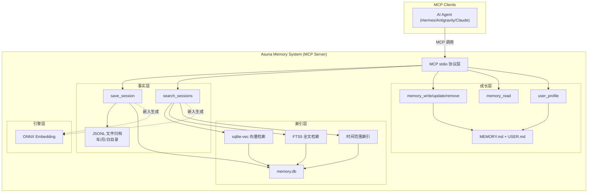

# Asuna Memory System — 设计决策文档

> 基于 RustRAG 技术栈的**全新独立**记忆系统

---

## 零、项目定位

### 与 RustRAG 的关系

|          | RustRAG                      | Asuna Memory System          |
| -------- | ---------------------------- | ---------------------------- |
| 定位     | 代码/文档 RAG MCP 服务器     | AI Agent 通用记忆系统        |
| 核心功能 | 语义检索、代码解析、关系图谱 | 对话存档、有界记忆、用户建模 |
| 关系     | 技术底座来源                 | **独立项目**，复用底层引擎   |

### 从 RustRAG 复用的组件

| 组件                  | 复用方式                           |
| --------------------- | ---------------------------------- |
| SQLite + sqlite-vec   | ✅ 直接复用，向量检索核心          |
| ONNX embedding 引擎   | ✅ 直接复用，multilingual-e5-small |
| MCP stdio server 框架 | ✅ 复用通信协议层                  |
| 配置系统              | ⚠️ 简化后复用                      |

### 不复用的组件

Tree-sitter AST 解析、代码关系图谱、多语言词典、Markdown frontmatter — 均与记忆系统无关。

---

## 一、对话记录全量保存方案

### 核心原则

> 原始对话是**事实层的基石**，必须全量保存、不可篡改、带明确时间索引。

### 1.1 双层存储架构

```
JSONL 文件（事实层）         SQLite 数据库（索引层）
┌─────────────────────┐     ┌──────────────────────┐
│ 原始对话全量归档      │     │ 向量索引              │
│ 不可修改             │ ──→ │ FTS5 全文检索          │
│ 按时间目录组织        │     │ 时间范围查询           │
│ git 可管理           │     │ 可从文件完整重建       │
└─────────────────────┘     └──────────────────────┘
     ↑ 持久真相源                ↑ 可消耗品
```

**为什么双层？**

- JSONL 文件 = 不可变的事实源（即使数据库损坏，也可从文件完全重建索引）
- SQLite = 高效检索索引（向量搜索、FTS、时间范围查询）

### 1.2 文件组织结构

```
data/
├── conversations/                 # 对话事实层
│   └── 2026/
│       └── 04/
│           └── 10/
│               ├── 20260410T100200_abc123.jsonl
│               └── 20260410T143000_def456.jsonl
├── memory/                        # 有界记忆（成长层）
│   ├── MEMORY.md                  # Agent 笔记
│   └── USER.md                    # 用户画像
├── memory.db                      # SQLite 索引数据库
└── config.json                    # 系统配置
```

### 1.3 JSONL 文件格式

每个会话一个文件，第一行为会话元数据，后续每行一轮对话：

```jsonc
// 第一行：会话头（元数据）
{
  "v": 1,
  "type": "session_header",
  "session_id": "abc123",
  "start_time": "2026-04-10T10:02:00.000+08:00",
  "profile_id": "default",
  "agent": "gemini-2.5-pro",
  "source": "antigravity"           // 来源客户端标识
}

// 后续行：每轮对话
{
  "ts": "2026-04-10T10:02:05.123+08:00",
  "role": "user",
  "content": "帮我查一下 RustRAG 的架构"
}

{
  "ts": "2026-04-10T10:02:07.456+08:00",
  "role": "assistant",
  "content": "RustRAG 的核心架构包括...",
  "model": "gemini-2.5-pro",
  "usage": {"input_tokens": 150, "output_tokens": 300}
}

{
  "ts": "2026-04-10T10:02:08.789+08:00",
  "role": "tool_call",
  "name": "search",
  "arguments": {"query": "RustRAG architecture"},
  "result": "..."
}
```

### 1.4 时间索引体系

四级时间索引，从粗到细：

| 层级       | 粒度     | 实现                                   | 查询示例                 |
| ---------- | -------- | -------------------------------------- | ------------------------ |
| **目录级** | 年/月/日 | 文件路径 `2026/04/10/`                 | "2026年4月的所有对话"    |
| **文件级** | 会话粒度 | 文件名 `20260410T100200_id.jsonl`      | "今天10点那次对话"       |
| **行级**   | 每轮对话 | `ts` 字段，ISO 8601 毫秒精度           | "那句话具体什么时候说的" |
| **索引级** | 毫秒精度 | SQLite `timestamp_ms` INTEGER + B-tree | 任意时间范围高效查询     |

### 1.5 SQLite 索引层 Schema

```sql
-- 会话索引
CREATE TABLE sessions (
    session_id   TEXT PRIMARY KEY,
    start_ts     INTEGER NOT NULL,    -- Unix ms
    end_ts       INTEGER,
    file_path    TEXT NOT NULL,        -- 对应 JSONL 文件路径
    title        TEXT,                 -- 会话标题（可由 Agent 生成）
    summary      TEXT,                 -- 会话摘要（成长层，可更新）
    profile_id   TEXT DEFAULT 'default',
    source       TEXT,                 -- 来源客户端
    turn_count   INTEGER DEFAULT 0
);
CREATE INDEX idx_sessions_ts ON sessions(start_ts);

-- 对话轮次索引
CREATE TABLE turns (
    id           INTEGER PRIMARY KEY AUTOINCREMENT,
    session_id   TEXT NOT NULL REFERENCES sessions(session_id),
    turn_index   INTEGER NOT NULL,     -- 轮次序号
    timestamp_ms INTEGER NOT NULL,     -- Unix ms
    role         TEXT NOT NULL,        -- user/assistant/tool_call/system
    preview      TEXT,                 -- 前 200 字符预览
    embedding    BLOB                  -- 向量索引（按需生成）
);
CREATE INDEX idx_turns_ts ON turns(timestamp_ms);
CREATE INDEX idx_turns_session ON turns(session_id, turn_index);

-- FTS5 全文检索
CREATE VIRTUAL TABLE turns_fts USING fts5(
    preview,
    content=turns,
    content_rowid=id
);
```

---

## 二、触发机制

RustRAG 同理，记忆系统作为 MCP server 是被动的。触发保存由调用方负责：

| 触发方式                      | 实现             | 说明                                         |
| ----------------------------- | ---------------- | -------------------------------------------- |
| Agent 主动调用 `save_session` | MCP 工具         | 在 system prompt 中指示 Agent 会话结束时调用 |
| Agent 框架 Hook               | Session end hook | Hermes/OpenClaw 等框架的生命周期钩子         |
| 手动保存                      | 用户指令         | "记住我们刚才的对话"                         |

### save_session 工具接口

```json
{
  "name": "save_session",
  "description": "保存完整对话到记忆系统事实层",
  "parameters": {
    "session_id": "会话唯一标识",
    "turns": [
      {
        "timestamp": "ISO 8601 时间戳",
        "role": "user | assistant | tool_call | system",
        "content": "对话内容",
        "metadata": {}
      }
    ],
    "source": "来源标识（可选）"
  }
}
```

---

## 三、MCP 工具清单（记忆系统）

| 工具              | 功能                       | 所属层 |
| ----------------- | -------------------------- | ------ |
| `save_session`    | 保存完整对话               | 事实层 |
| `search_sessions` | 按语义/关键词/时间回溯对话 | 事实层 |
| `memory_write`    | 写入有界记忆条目           | 成长层 |
| `memory_update`   | 更新/替换记忆条目          | 成长层 |
| `memory_remove`   | 删除记忆条目               | 成长层 |
| `memory_read`     | 读取当前有界记忆全文       | 成长层 |
| `user_profile`    | 读写用户画像               | 成长层 |

---

## 四、架构总览


