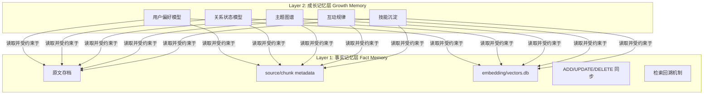

# AI Agent 记忆系统 — 综合研究报告

> 基于 `memory-system-memo.md`、`RustRAG` 项目、`Hermes Agent` Memory 系统的全面对照分析

---

## 一、信息源概览

| 来源                                                                                   | 核心内容                                     | 定位         |
| -------------------------------------------------------------------------------------- | -------------------------------------------- | ------------ |
| [memory-system-memo.md](file:///e:/DEV/Asuna_memory_system/docs/memory-system-memo.md) | 双层记忆架构规划（事实层 + 成长层）          | 系统设计蓝图 |
| [RustRAG](file:///E:/DEV/RustRAG) v1.3.7                                               | 本地 RAG MCP 服务器，7 个工具                | 底座技术实现 |
| [Hermes Agent](https://github.com/NousResearch/hermes-agent)                           | "与你共同成长的 Agent"，内建 Memory + Skills | 上层参考架构 |

---

## 二、Memo 规划要点回顾

### 2.1 核心判断

> **最好的方案不是纯 Hermes，也不是纯 RustRAG。而是：当前这套"事实记忆底座" + Hermes 风格的"成长记忆上层"。**

### 2.2 双层架构

### 2.3 关键约束

- 成长层是"**可撤销的解释层**"，不是事实层
- 成长层可以：提炼、归纳、假设、偏好推断
- 成长层**不能**：覆盖原始事实、替代原始对话、无审计改写用户画像

---

## 三、RustRAG 现有能力清单

### 3.1 技术栈

| 能力          | 状态 | 细节                                   |
| ------------- | ---- | -------------------------------------- |
| 本地向量检索  | ✅   | SQLite + sqlite-vec，INT8 量化，毫秒级 |
| ONNX 嵌入     | ✅   | multilingual-e5-small，支持 GPU 加速   |
| AST 代码解析  | ✅   | Tree-sitter (Rust/Go/Python/TS/JS)     |
| 关系图谱      | ✅   | calls / imports / inherits             |
| Markdown 处理 | ✅   | pulldown-cmark 分块 + frontmatter      |
| 多语言词典    | ✅   | 中日韩↔英映射                          |
| 文件热监控    | ✅   | 增量索引同步                           |
| 配置热重载    | ✅   | RwLock + 自动重建模型                  |
| 远程 SSH 部署 | ✅   | MCP stdio 跨端挂载                     |

### 3.2 七个 MCP 工具

`search` · `index` · `manage_document` · `list_documents` · `frontmatter` · `search_relations` · `build_dictionary`

### 3.3 与记忆系统的关联定位

RustRAG 天然覆盖了**事实记忆层 (Layer 1)** 的大部分需求：原文保真 ✅ / 动态索引 ✅ / 可删除可更新 ✅ / 本地可控 ✅ / 可追溯 ✅

**欠缺项（需扩展）：**

- ❌ 会话级原始对话存档
- ❌ 时间线 / 会话溯源
- ❌ 多用户 / 多 profile 隔离
- ❌ 对话摘要 / 压缩机制

---

## 四、Hermes Agent Memory 系统深度分析

### 4.1 内建记忆

| 特性 | 实现方式                                                          |
| ---- | ----------------------------------------------------------------- |
| 存储 | `MEMORY.md`（2200 字符）+ `USER.md`（1375 字符），`§` 分隔条目    |
| 注入 | 会话开始 → 冻结快照注入 system prompt → 会话内不变                |
| 操作 | `memory` tool：`add` / `replace` / `remove`（substring matching） |
| 容量 | 有界 ~1300 tokens，满时 Agent 自动整合替换                        |
| 安全 | 注入前扫描 prompt injection / 凭据泄露 / 不可见 Unicode           |

### 4.2 Session Search

- SQLite + **FTS5** 全文搜索存储所有历史会话
- Gemini Flash 对搜索结果做摘要
- 定位："上周我们讨论了X吗？"类型的回溯查询

### 4.3 外部 Memory Provider 插件

8 个 provider，仅可同时启用一个，与内建 memory 共存。

### 4.4 Skills 自学习系统

Agent 从经验自动创建 `SKILL.md` → 按需渐进式注入 → 对应 memo 中"成长层"的"技能沉淀"

---

## 五、架构对比分析

### 5.1 能力矩阵

| 能力维度     | RustRAG       | Hermes Memory    | Memo 规划 |
| ------------ | ------------- | ---------------- | --------- |
| 原文保真存储 | ✅ chunk 级   | ❌ 仅摘要级      | ✅ 必须   |
| 向量语义检索 | ✅ 核心       | ⚠️ 依赖 provider | ✅ 底座   |
| 代码理解     | ✅ AST+关系   | ❌               | ✅ 底座   |
| 有界记忆注入 | ❌            | ✅ 核心          | ✅ 成长层 |
| 用户建模     | ❌            | ✅ USER.md       | ✅ 成长层 |
| 会话搜索     | ❌            | ✅ FTS5          | ✅ 需要   |
| 技能沉淀     | ❌            | ✅ Skills        | ✅ 成长层 |
| 动态索引     | ✅ 文件热监控 | ❌               | ✅ 底座   |
| 本地完全可控 | ✅            | ⚠️ 部分          | ✅ 必须   |

---

## 六、关键洞察

1. **RustRAG 已是强大的事实记忆层底座**，核心补全方向：会话原文存档 + 时间线/会话级 metadata
2. **Hermes 的"有界记忆 + 冻结快照"模式**极为务实。
3. **Memo 中"成长层不能覆盖事实层"的约束**是核心差异化优势。
